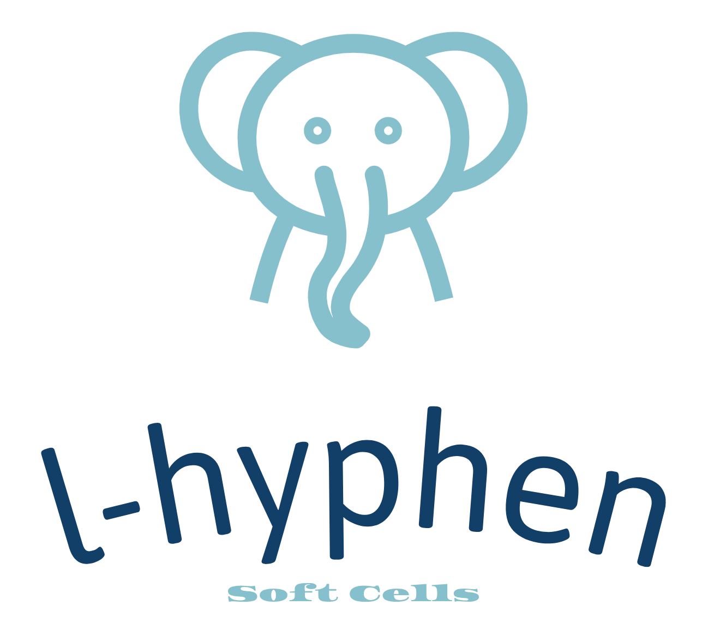

## What is `l-hyphen`?

`l-hyphen` is a 2D numerical model designed to simulate the **dynamics of deformable soft particles**. It employs a **core-shell** approach to represent particles capable of undergoing large deformations while maintaining their mechanical integrity.

* **Geometric representation**: each particle is modeled as a thin shell composed of interconnected nodes (or lumped mass points). These nodes are linked by elastic or elasto-plastic elements, forming a deformable structure.

* **Shape Degrees of Freedom**: particle deformations are controlled by:

  * **Elasticity/plasticity of bar elements**: segments connecting nodes can stretch or compress according to elastic or plastic laws.

  * **Bending elasticity/plasticity of cell-wall**: angles between adjacent segments are regulated to maintain or alter the particle's shape.

  * **Core Stiffness**: An internal core controls volume changes in the particle, simulating effects like internal pressure or fluid presence.

* **Particle interactions**: particles interact through contact, friction, or cohesive forces, enabling the simulation of granular assemblies or cellular tissues.

> This model is particularly suited for studying 
> systems where particles undergo significant 
> deformations, such as foams, emulsions, 
> microfluidic capsules, or cellular materials.

## Key features

* **Dynamic approach**: the model uses a time integration scheme (Velocity-Verlet) to solve the equations of motion just like the discrete element method does.

* **Flexibility**: it can simulate elastic, plastic, or combined behaviors based on the defined mechanical properties of the cell-particles.

* **Numerical efficiency**: by concentrating mass on nodes and using simplified interaction laws, the model remains computationally efficient for complex systems.

## Credits

The `l-hyphen` model was originally developed during _Yohann Trivino_'s PhD research, supervised by _Jean-Yves Delenne_ and _Farhang Radjaï_. The C++ implementation is primarily maintained by _Vincent Richefeu_.

