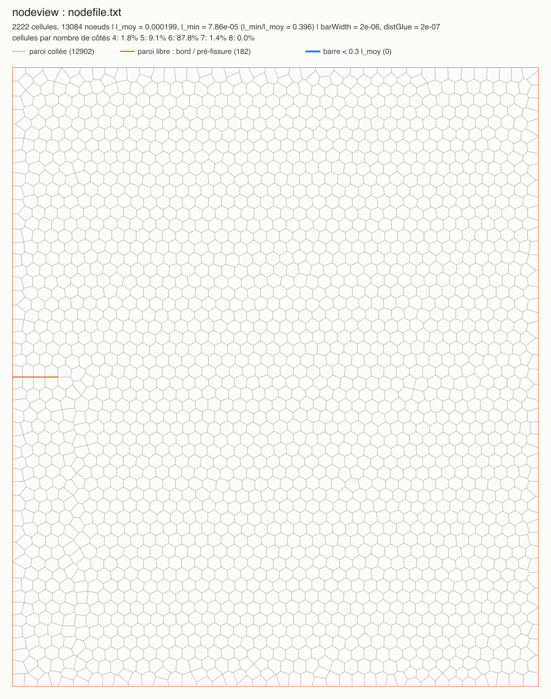

# Étude paramétrique (xi, zeta) sur des échantillons de type *Frank-ouverture-fissure*

Reprise complète de l'étude de `etude-param-model/` avec un échantillon de mêmes dimensions et de même nombre de
cellules que *Frank-ouverture-fissure* (13.6 mm × 16 mm, environ 2200 cellules), et une grille plus fine :

```
xi, zeta ∈ {0.1, 0.25, 0.5, 0.75, 1, 2, 3, 4, 5, 7.5, 10}      soit 11 × 11 = 121 cas
```

Les outils sont les mêmes que dans `etude-param-model/` (dont le `README.md` détaille chacun d'eux) ; ce
document donne la marche à suivre complète et ce qui change pour cette étude.

| Étape | Fichiers |
|---|---|
| 1. Échantillon | `echantillon/params.txt` → `nodegen` → `echantillon/nodefile.txt` |
| 2. Modèle d'input | `input_model.txt` (paramètres `XI`, `ZETA`) |
| 3. Génération des cas | `plan.txt` → `generate_cases` → `cases/` (121 répertoires) |
| 4. Lancement | `run_cases.sh` (parallèle, reprise) |
| Dépouillement | `cases/plot_maps.py`, `cases/plot_curves.py`, `cases/plot_snapshots.py` |

---

## 1. Échantillon

```bash
cd nodeGen && make && cd ../etude-param-frank/echantillon
../../nodeGen/nodegen params.txt
```

| | *Frank-ouverture-fissure* (`cellPrepro`) | cette étude (`nodegen`) |
|---|---|---|
| domaine | 13.6 mm × 16 mm | 13.6 mm × 16 mm |
| cellules / nœuds | 2155 / 12798 | 2222 / 13084 |
| diamètre équivalent des cellules | 0.353 mm | 0.353 mm (`cellSize`) |
| pré-entaille | 1.2 mm environ, cellules retirées | 1.2 mm, nette, depuis le milieu du bord gauche |
| `l_min / l_moy` | 0.012 | 0.40 (pas de barre courte) |
| cellules à 6 côtés (toutes les cellules) | 66 % | 88 % (94 % des cellules intérieures ; `lattice hex`, `disorder 0.3`) |

Le pavage est le même que celui du tutoriel de `nodegen` (`nodeGen/doc/tutorial_params.txt`), placé à
l'origine. La pointe effective de l'entaille est en (1.181 mm, 8 mm). Les mors attrapent la rangée de nœuds du
bord : 82 nœuds en bas, 79 en haut.



## 2. Modèle d'input `input_model.txt`

Même construction que dans `etude-param-model` : seules les lignes `define XI` et `define ZETA` changent d'un
cas à l'autre, et l-hyphen calcule

```
kb = xi ks l²        Kcell = 12 xi ks / (1 + 9 xi)        kc = zeta Kcell
```

avec `ks = 2000 N/m` et `l = 1.986276e-4 m` (longueur moyenne des barres de cet échantillon). `kb` sert à la
flexion des parois, `kc` aux liens cohésifs et au contact. Pour `xi = zeta = 10`, ce sont exactement les valeurs
de *Frank-ouverture-fissure* (à `l` près).

`dt = 5e-8 s` est stable sur toute la grille (`dt_crit/dt ≥ 16`, flexion pour `xi = 10`).

**Ce qui change par rapport à `etude-param-model` : les sorties.** Avec 2222 cellules, un conf pèse 3.3 Mo et un
`sample*.svg` environ 2 Mo : avec les réglages de la première étude, l'étude complète aurait occupé plusieurs
dizaines de Go. Le modèle utilise donc le mot-clé `nstepPeriodCapture` (ajouté à l-hyphen pour cette étude), qui
découple l'écriture de `top.txt` / `bottom.txt` de celle des svg :

| Sortie | Période | Rôle |
|---|---|---|
| `sample*.svg` | aucune (`nstepPeriodSVG 0`) | |
| `top.txt`, `bottom.txt` | `TCAPT = 0.1 ms` (`nstepPeriodCapture`) | courbes force – ouverture ; 5 fois plus fines que dans la première étude, d'où un pic mieux résolu |
| `conf*` | `TCONF = 1 ms`, plus un conf à la première rupture (`event saveConfAtBrokenLength 0`) | images see2 |

L'arrêt se fait 5 ms après une chute de 30 % de la force du mors haut (`event stopAfterStressDrop`), au lieu de
1 ms dans la première étude : la fissure a le temps de traverser l'échantillon (environ 3 ms dans *Frank*), ce
qui donne des faciès de rupture complets. `TFINAL = 0.15 s` n'est qu'une durée de sécurité.

Calibration sur les quatre coins et le centre de la grille (4 calculs simultanés sur cette machine) :

| xi | zeta | pic de force | chute détectée | arrêt | temps de calcul | disque |
|---|---|---|---|---|---|---|
| 0.1 | 0.1 | 8.3 mN | 50.7 ms | 55.7 ms | 19 min | 192 Mo |
| 0.1 | 10 | 44.7 mN | 59.7 ms | 64.7 ms | 22 min | 219 Mo |
| 1 | 1 | 24.0 mN | 23.5 ms | 28.5 ms | 11 min | 104 Mo |
| 10 | 0.1 | 12.1 mN | 35.6 ms | 40.6 ms | 14 min | 147 Mo |
| 10 | 10 | 42.5 mN | 28.4 ms | 33.4 ms | 11 min | 122 Mo |

Tous les cas s'arrêtent par l'événement, bien avant `TFINAL`. Pour l'étude complète, compter **10 à 25 min de
calcul par cas** et **environ 150 Mo par cas, soit 15 à 25 Go pour les 121 cas** (essentiellement les conf).
Sur une machine à 4 cœurs performance, l'étude prend de l'ordre de 8 h avec `-j 4`.

## 3. Générer les cas

```bash
cd etude-param-frank
make                          # compile generate_cases
./generate_cases              # crée cases/ : 121 répertoires XI<xi>_ZETA<zeta>/ (input.txt + nodefile.txt)
```

Un cas existant n'est pas modifié (ses résultats sont préservés) ; `--force` réécrit les `input.txt` sans toucher
aux résultats ; `--dry-run` affiche la liste des cas.

## 4. Lancer les calculs

Sur la machine de calcul (les cas sont ignorés par git, on les régénère sur place) :

```bash
git clone <dépôt> l-hyphen && cd l-hyphen
make                                     # compile run et see2
cd etude-param-frank
make && ./generate_cases
nohup ./run_cases.sh -j <nombre de cœurs> > run_cases.log 2>&1 &
./run_cases.sh -s                        # état de l'étude à tout moment
```

Sous macOS, empêcher la mise en veille pendant les calculs (sinon ils sont suspendus) :

```bash
nohup caffeinate -i ./run_cases.sh -j 4 > run_cases.log 2>&1 &
```

**Important : compiler l-hyphen à partir d'un répertoire propre** (`make clean && make` à la racine) si des
fichiers objets d'une version antérieure existent. Avant l'ajout des dépendances aux en-têtes dans le `Makefile`,
un objet non recompilé (`Event.o`) lisait les membres de `Lhyphen` à de mauvaises positions après l'ajout de
`nstepPeriodCapture` : les conf des événements écrasaient `conf0` et `conf1`.

Pour reprendre après un problème (interruption, redémarrage, échec), relancer la même commande : les cas
terminés sont sautés, les cas interrompus ou en échec sont relancés depuis le début (au plus 3 tentatives,
option `-m`). Voir `etude-param-model/README.md`, étape 4, pour le détail (`status.txt`, options, détection des
échecs).

## Dépouillement

```bash
cd etude-param-frank/cases
python3 plot_maps.py          # carte_raideur.png, carte_forces_rupture.png, resultats.csv
python3 plot_curves.py        # courbes_force_ouverture.png
python3 plot_snapshots.py     # images_rupture.png, images_deformation.png, images_contrainte.png,
                              # images_dirs_deformation.png, images_dirs_contrainte.png (see2 compilé requis)
```

Les scripts sont ceux de la première étude, adaptés aux nouvelles sorties :

- la période de `top.txt` / `bottom.txt` est lue dans l'input de chaque cas (`define TCAPT`) ;
- les conf rendus par `see2` sont choisis d'après leur temps : dernier conf (faciès de rupture), dernier conf avant
  le pic de force (champs), conf sauvegardé à la première rupture (directions principales « à l'initiation »).

Les grandeurs, les cartes et les options (`--vue`, `--echelle par_cas`…) sont décrites dans
`etude-param-model/README.md`, section « Dépouillement ».
