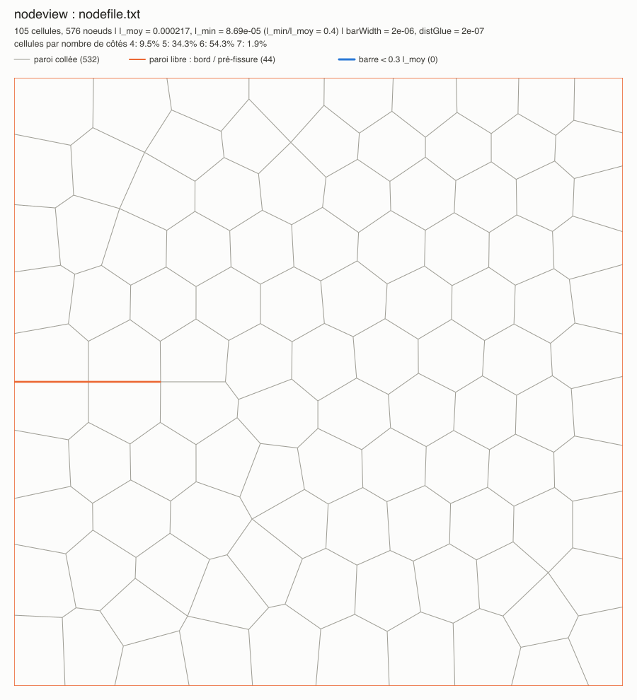
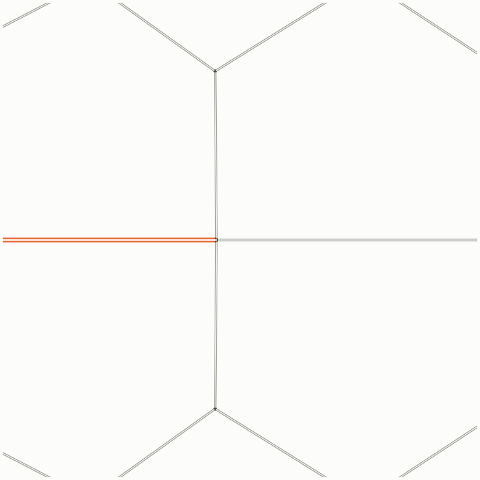
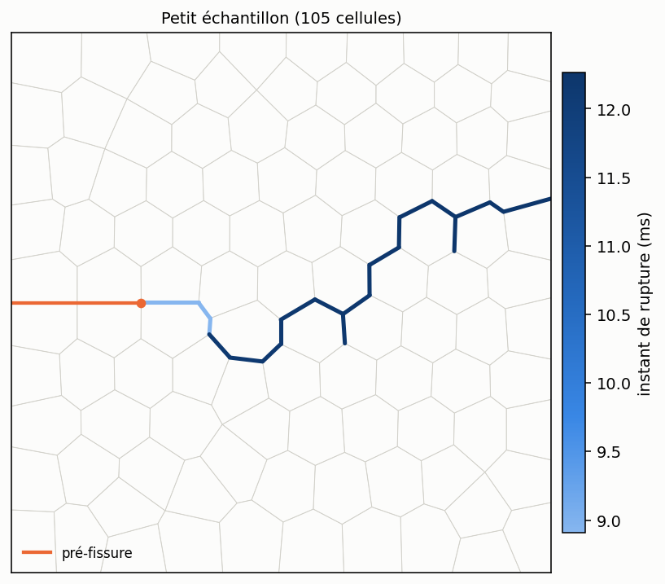

# Étude paramétrique — exemple de mise en place

Ce répertoire montre comment préparer et lancer une étude paramétrique avec l-hyphen, sur un petit
échantillon (≈ 100 cellules, avec une pré-entaille). La démarche se fait en quatre étapes :

| Étape | Contenu | État |
|---|---|---|
| 1. Échantillon | génération du nodeFile avec `nodegen` (`echantillon/`) | ✅ fait |
| 2. Modèle d'input | `input_model.txt` : input l-hyphen complet dont deux lignes (`XI`, `ZETA`) sont les paramètres de l'étude | ✅ fait |
| 3. Génération des cas | `generate_cases` (C++) lit `plan.txt` et crée un répertoire autonome par combinaison de paramètres | ✅ fait |
| 4. Lancement | `run_cases.sh` lance les cas en parallèle et reprend l'étude après une interruption ou un échec | ✅ fait |

---

## Étape 1 — Créer l'échantillon avec `nodegen`

### Prérequis

`nodegen` et `nodeview` se trouvent dans `nodeGen/` à la racine du dépôt (C++17, aucune dépendance) :

```bash
cd nodeGen && make        # produit nodeGen/nodegen et nodeGen/nodeview
```

Le tutoriel complet de l'outil (algorithmes, tous les paramètres) est dans `nodeGen/doc/tutorial_nodegen.pdf`.

### Générer l'échantillon

Tous les réglages sont dans `echantillon/params.txt` :

```bash
cd etude-param-model/echantillon
../../nodeGen/nodegen params.txt
```

La génération est instantanée et produit :

| Fichier | Contenu |
|---|---|
| `nodefile.txt` | le nodeFile (`x y idCellule`), à lire par `readNodeFile` |
| `nodefile.svg` | vue d'analyse (non suivie par git : les `*.svg` sont ignorés) |
| `nodegen_input.txt` | lignes d'input propres à cet échantillon (`readNodeFile`, mors, `captureNodes`, collage), qui serviront à écrire le modèle d'input de l'étape 2 |

### Les choix faits dans `params.txt`

| Réglage | Valeur | Pourquoi |
|---|---|---|
| `Lx`, `Ly` | 3.2 mm × 3.2 mm | avec `cellSize 3.53e-4` (taille des cellules de *Frank-ouverture-fissure*), cela donne ≈ 105 cellules |
| `lattice hex`, `disorder 0.3` | | pavage dominé par des hexagones (et des pentagones), sans cellule à 4 côtés à l'intérieur |
| `minEdgeRatio 0.4`, `minSides 5` | | aucune barre courte : la plus courte vaut 0.4 × la longueur moyenne, ce qui garde un pas de temps raisonnable |
| `crack 0 1.6e-3 0.8e-3 1.6e-3` | 0.8 mm | pré-entaille depuis le milieu du bord gauche, sur un quart de la largeur |
| `opening 2e-6`, `distGlue 2e-7` | | les lèvres de l'entaille sont écartées de `barWidth + opening` = 4 µm : elles ne sont pas collées (il faut garder `distGcGlue` < `opening` dans l'input) |
| `tipInterface 1` | | l'entaille se termine sur une interface collée entre deux cellules, et non contre une cellule |
| `gripRows 1`, `pullVelocity 3e-4` | | les mors haut et bas n'attrapent que la rangée de nœuds du bord, tirés à ±0.3 mm/s |
| `seed 1` | | une autre graine donne un autre échantillon de mêmes statistiques |

### Vérifier l'échantillon

La sortie de `nodegen` doit ressembler à :

```
  cellules          : 105 (visé 105), noeuds : 576
  barres            : l_moy = 0.0002169, l_min = 8.685e-05 (l_min/l_moy = 0.4004)
  côtés (intérieur) : 5: 26.1%  6: 71.0%  7: 2.9%  (69 cellules)
  parois            : 532 collées, 44 libres (bords + fissure)
  pré-fissure       : 4 parois ouvertes (barWidth + 2e-06), pointe effective en (0.0007703, 0.0016) au lieu de (0.0008, 0.0016)
  mors bas          : 20 noeuds (1 rangée)
  mors haut         : 18 noeuds (1 rangée)
```

Points à contrôler :

- **`l_min/l_moy`** de l'ordre de `minEdgeRatio` : pas de barre courte, donc pas besoin de `cleanShortBars` ;
- **pointe effective** : la pointe de l'entaille est toujours un sommet du pavage, ici à 0.77 mm au lieu de 0.8 mm ;
- **mors** : une rangée de nœuds, 20 en bas et 18 en haut.



*Vue produite par `nodeview` (`echantillon.png`) : parois collées en gris, parois libres (bords et entaille) en
orange. Les petites cellules de la rangée du bas et de la rangée du haut sont coupées par le domaine.*

Pour regarder un détail, par exemple la pointe de l'entaille, avec les nœuds :

```bash
../../nodeGen/nodeview nodefile.txt -box 0.0005 0.0011 0.0013 0.0019 -nodes -o pointe.svg
```



*Pointe de l'entaille : les lèvres (orange) sont écartées ; au-delà de la pointe, la ligne se poursuit par une
interface collée (gris) entre deux cellules.*

### Vérification en simulation

L'échantillon a été testé avec l'input de *Frank-ouverture-fissure* (mêmes propriétés mécaniques, `dt = 5e-8`,
0.045 s simulées), adapté automatiquement par `nodegen` (`inputTemplate`, voir le tutoriel de `nodegen`) :

- 532 liens collés (égal au nombre de parois collées affiché par `nodegen`), aucune rupture au démarrage ;
- pas de temps critique de flexion 8.7e-7 s, soit 17 × `dt` ;
- **22 s de calcul** sur un cœur ;
- la rupture s'amorce à la pointe de l'entaille (premier lien rompu à 0.17 mm de la pointe, à t = 8.9 ms) et la
  fissure traverse l'échantillon jusqu'au bord droit (20 liens rompus).



*Liens rompus, colorés selon l'instant de rupture ; en orange, la pré-entaille.*

### Faire varier l'échantillon dans l'étude

Les paramètres géométriques peuvent eux-mêmes faire partie de l'étude. Il suffit de générer un nodeFile par
variante, en changeant par exemple :

- `seed` : plusieurs réalisations statistiquement équivalentes (dispersion des résultats) ;
- `disorder` : régularité du pavage ;
- la longueur de l'entaille (`crack x0 y0 x1 y1`) ;
- `cellSize` (et `Lx`, `Ly`) : nombre de cellules.

`barWidth` doit rester égal à la valeur utilisée dans `readNodeFile`, et `opening` supérieur à `distGcGlue`.

---

## Étape 2 — Le modèle d'input `input_model.txt`

### Paramètres de l'étude

On note `ks` la raideur axiale des barres, `kb` la raideur de flexion entre deux barres d'une cellule, `l` la
longueur moyenne des barres et `kc` la raideur des points de cohésion. L'étude porte sur deux nombres sans
dimension :

```
xi    = kb / (ks l²)                 flexion / traction des parois
zeta  = kc / Kcell                   cohésion / raideur d'une cellule
Kcell = 12 xi ks / (1 + 9 xi)
```

`ks` est fixé (valeur de *Frank-ouverture-fissure*), `kb` est choisi pour obtenir `xi`, puis `kc` pour obtenir
`zeta` :

```
kb = xi ks l²        kc = zeta Kcell
```

Ces relations redonnent exactement les valeurs de *Frank-ouverture-fissure* (`param_meca.txt`) pour
`xi = zeta = 10` et `l = 1.991e-4`. La grille visée est `xi`, `zeta` ∈ {0.1, 0.5, 1, 5, 10}, soit 25 cas.

### Organisation du fichier

`input_model.txt` est un **input l-hyphen complet**, lançable tel quel (il vaut alors `xi = zeta = 10`). Les
raideurs ne sont pas écrites en dur : l-hyphen les calcule lui-même à partir des constantes `define` et
d'expressions `$...$`. Seules deux lignes, marquées `PARAMETRE`, changent d'un cas à l'autre :

```
define XI    10      # PARAMETRE
define ZETA  10      # PARAMETRE

define KS    2000                    # raideur axiale des barres (N/m)
define L     2.169325e-4             # longueur moyenne des barres de echantillon/nodefile.txt (m)
...
define KB     $XI*KS*L*L$            # raideur de flexion (N.m/rad)
define KCELL  $12*XI*KS/(1+9*XI)$    # raideur d'une cellule (N/m)
define KC     $ZETA*KCELL$           # raideur des liens cohésifs (N/m)
```

`KB` est utilisé dans `readNodeFile` (raideur de flexion, et `Mz_max = 1e11 KB`, c'est-à-dire sans
plasticité), `KC` dans `setGcGlueSameProperties` (raideurs normale et tangentielle des liens) et pour le contact
(`kn`, `kt`), comme dans *Frank-ouverture-fissure*.

`L` est la longueur moyenne des barres de **cet** échantillon (calculée comme dans l-hyphen, qui l'affiche aussi
dans `diagnostic.txt`). Si l'échantillon est régénéré avec d'autres paramètres, il faut mettre à jour `L`, ainsi
que les boîtes des mors (lignes `setNodeControlInBox` et `captureNodes`, à reprendre dans `nodegen_input.txt`) :
ces deux commandes n'acceptent pas d'expression.

### Valeurs de la grille

`l = 2.169325e-4 m`, `ks = 2000 N/m` :

| xi | kb (N·m/rad) | Kcell (N/m) | kc pour zeta = 0.1 | 0.5 | 1 | 5 | 10 |
|---|---|---|---|---|---|---|---|
| 0.1 | 9.412e-6 | 1263.2 | 126.3 | 631.6 | 1263.2 | 6315.8 | 12631.6 |
| 0.5 | 4.706e-5 | 2181.8 | 218.2 | 1090.9 | 2181.8 | 10909.1 | 21818.2 |
| 1 | 9.412e-5 | 2400.0 | 240.0 | 1200.0 | 2400.0 | 12000.0 | 24000.0 |
| 5 | 4.706e-4 | 2608.7 | 260.9 | 1304.3 | 2608.7 | 13043.5 | 26087.0 |
| 10 | 9.412e-4 | 2637.4 | 263.7 | 1318.7 | 2637.4 | 13186.8 | 26373.6 |

### Pas de temps et durée

`dt = 5e-8 s` est stable pour toute la grille : le cas le plus contraignant est `xi = 10` (flexion,
`dt_crit/dt = 16`) ; pour le contact et la cohésion, `dt_crit/dt ≥ 49`. Le même `dt` est gardé pour tous les cas
afin qu'ils restent comparables.

L'instant de rupture varie d'un cas à l'autre (d'un facteur 2 ou 3 sur la grille). Plutôt qu'une durée fixe,
chaque calcul s'arrête peu après la rupture grâce à l'événement

```
event stopAfterStressDrop 1  y  30  0.001  0.0005  1e-4
```

qui arrête la simulation 1 ms après une chute de 30 % de la force du mors haut (contrôle 1). `TFINAL` n'est
qu'une durée maximale de sécurité (0.1 s). Les sorties (`conf*`, `sample*.svg`, `top.txt`, `bottom.txt`) sont écrites
toutes les `TOUT = 0.5 ms` de temps physique, quel que soit le cas.

Vérification sur les quatre coins et le centre de la grille (calculs complets, un cœur chacun) :

| xi | zeta | première rupture | arrêt | liens rompus | force au pic | temps de calcul |
|---|---|---|---|---|---|---|
| 0.1 | 0.1 | 16.0 ms | 17.4 ms | 13 | 2.80 mN | 10 s |
| 0.1 | 10 | 18.7 ms | 19.9 ms | 16 | 17.1 mN | 11 s |
| 1 | 1 | 7.4 ms | 10.8 ms | 15 | 8.78 mN | 7 s |
| 10 | 0.1 | 11.2 ms | 12.5 ms | 13 | 3.97 mN | 8 s |
| 10 | 10 | 8.8 ms | 13.0 ms | 20 | 16.6 mN | 8 s |

Tous les cas s'arrêtent par l'événement, bien avant `TFINAL`, en une dizaine de secondes de calcul : la grille
complète (25 cas) représente environ 4 minutes sur un cœur. La force au pic est la valeur lissée relevée par
l-hyphen dans `log.txt` (ligne `stress drop detected`).

L'arrêt intervient 1 ms après la chute de force, pas forcément quand l'échantillon est entièrement séparé. Pour
comparer les chemins de fissure complets, allonger le délai (4e paramètre de l'événement) ou augmenter la chute
demandée.

### Lancer un cas à la main

```bash
mkdir essai && cp input_model.txt essai/input.txt && cp echantillon/nodefile.txt essai/
cd essai
# modifier les lignes « define XI » et « define ZETA », puis :
../../run input.txt
```

C'est exactement ce que fera, pour chaque cas, le générateur de l'étape 3.

---

## Étape 3 — Générer les cas avec `generate_cases`

### Le fichier de plan `plan.txt`

```
model   input_model.txt              # modèle d'input (les paramètres y sont des lignes « define NOM valeur »)
copy    echantillon/nodefile.txt     # copié dans chaque cas, pour que chaque répertoire soit autonome
output  cases                        # répertoire des cas

# paramètre  valeurs
XI      0.1  0.5  1  5  10
ZETA    0.1  0.5  1  5  10
```

| Mot-clé | Rôle |
|---|---|
| `model` | modèle d'input ; chaque paramètre doit y être défini par une ligne `define NOM valeur` (et une seule) |
| `copy` | fichier(s) copié(s) dans chaque cas (plusieurs fichiers ou plusieurs lignes possibles) |
| `output` | répertoire des cas (défaut `cases`) |
| *toute autre ligne* | un paramètre : son nom (celui du `define`) suivi de ses valeurs |

Toutes les combinaisons des valeurs sont générées (produit cartésien) : ici 5 × 5 = 25 cas. On peut ajouter
d'autres paramètres sans toucher au programme, à condition qu'ils soient des `define` du modèle (par exemple
`GC` ou `MASS`, qui sont déjà des constantes de `input_model.txt`). Les valeurs sont recopiées telles quelles :
une expression l-hyphen (`$...$`) est acceptée. Les chemins sont relatifs au répertoire du plan.

### Compiler et lancer

```bash
cd etude-param-model
make                          # produit generate_cases (C++17, aucune dépendance)
./generate_cases --dry-run    # affiche les cas sans rien écrire
./generate_cases              # crée les cas
```

```
25 cas dans cases/ : 25 créés, 0 réécrits (--force), 0 existants conservés
liste des cas : cases/cases.txt
```

### Ce qui est produit

```
cases/
├── cases.txt            liste des cas : numéro, répertoire, valeurs des paramètres
├── plan.txt             copie du plan utilisé
├── XI0.1_ZETA0.1/
│   ├── input.txt        copie du modèle avec « define XI 0.1 » et « define ZETA 0.1 »
│   └── nodefile.txt
├── XI0.1_ZETA0.5/
...
```

Chaque répertoire est autonome : on y lance `run input.txt`, et c'est là que l-hyphen écrit ses résultats.
Dans `input.txt`, seules les lignes `define` des paramètres diffèrent du modèle (leur commentaire
`# PARAMETRE` est conservé), avec en tête une ligne qui indique le cas et le plan d'origine.

`cases/cases.txt` sert au lancement (étape 4) et au dépouillement :

```
# cas générés par generate_cases à partir de plan.txt
# id  répertoire  XI  ZETA
   1  XI0.1_ZETA0.1  0.1  0.1
   2  XI0.1_ZETA0.5  0.1  0.5
...
```

### Relancer le générateur

- un cas **déjà existant n'est pas modifié**, pour ne pas perdre ses résultats : on peut donc ajouter des valeurs
  au plan et relancer `./generate_cases`, seuls les nouveaux cas sont créés ;
- `--force` réécrit `input.txt` et les fichiers copiés de tous les cas (après une correction du modèle, par
  exemple), **sans effacer les résultats** déjà présents dans les répertoires ;
- pour repartir de zéro, supprimer les répertoires des cas (`rm -r cases/XI*`) ; les scripts `cases/plot_*.py` sont
  suivis par git et peuvent être restaurés avec `git checkout cases/`.

Vérification : le cas `XI1_ZETA1` généré donne exactement le même résultat que le cas préparé à la main à l'étape 2
(chute de force détectée à t = 9.80 ms, force au pic 8.78 mN, arrêt à 10.8 ms).

---

## Étape 4 — Lancer les calculs avec `run_cases.sh`

### Sur la machine de calcul

Les cas ne sont pas suivis par git (tout ce qui est généré est ignoré : le contenu de `cases/` sauf
les scripts `plot_*.py`, `generate_cases`,
`run_cases.log`, `echantillon/nodegen_input.txt`, `*.svg`). Sur la machine de calcul, on clone le dépôt et on
régénère les cas, ce qui donne exactement les mêmes fichiers : le plan, le modèle et l'échantillon
(`echantillon/nodefile.txt`) sont, eux, suivis par git.

```bash
git clone <dépôt> l-hyphen && cd l-hyphen
make                                   # compile run (l-hyphen)
cd etude-param-model
make && ./generate_cases               # crée cases/
nohup ./run_cases.sh -j 16 > run_cases.log 2>&1 &
```

`nohup ... &` permet de fermer la session sans arrêter les calculs. On peut aussi copier un répertoire `cases/`
déjà généré (par `rsync`), puisque chaque cas est autonome.

### Options

| Option | Rôle | Défaut |
|---|---|---|
| `-d DIR` | répertoire des cas | `cases` |
| `-j N` | nombre de calculs simultanés | nombre de cœurs |
| `-r RUN` | exécutable l-hyphen | `$LHYPHEN_RUN`, sinon `../run`, sinon `run` du `PATH` |
| `-t SEC` | durée maximale d'un calcul (au-delà, le cas est arrêté et compté en échec) | aucune |
| `-m N` | nombre maximal de tentatives par cas | 3 |
| `-s` | affiche seulement l'état de l'étude | |

### Suivre l'étude

```bash
tail -f run_cases.log        # lancements, fins et échecs au fil de l'eau
./run_cases.sh -s            # bilan : terminés, en échec, en cours, interrompus, à faire
```

```
[12:26:13] lancement : XI1_ZETA0.5
[12:26:17] ÉCHEC    : XI1_ZETA5 (tentative 1, aucune cellule (nodeFile introuvable ?) ; voir XI1_ZETA5/log.txt)
[12:26:20] terminé  : XI1_ZETA0.5 (7 s, fin : événement)
...
État : 24 terminés, 1 en échec, 0 en cours, 0 interrompus, 0 à faire
```

Chaque cas est lancé dans son répertoire (`run input.txt > log.txt`), et son état est écrit dans
`<cas>/status.txt` ; `<cas>/attempts.txt` compte les tentatives.

| `status.txt` | Signification |
|---|---|
| `done <date> <durée> s événement` | terminé par l'événement d'arrêt (cas normal de cette étude) |
| `done <date> <durée> s TFINAL ...` | terminé à `TFINAL` sans que l'événement d'arrêt se soit déclenché : à examiner |
| `failed <date> code <rc> <raison>` | échec, voir `log.txt` |
| `running <hôte> <pid> <date>` | en cours ; si le processus n'existe plus, le cas est considéré comme interrompu |

Un cas est en échec si `run` rend un code non nul, si la durée maximale `-t` est dépassée, si le système est vide
(`diagnostic.txt` absent ou `Cellules : 0` : `run` rend 0 quand le nodeFile est introuvable et simule alors un
système vide) ou si `nan` apparaît dans `top.txt`, `bottom.txt` ou `breakEvol.txt` (divergence).

### Reprendre après un problème

Il suffit de **relancer la même commande** :

- les cas terminés sont sautés ;
- les cas interrompus (Ctrl-C, `kill`, machine redémarrée : `status.txt` dit `running` mais le processus n'existe
  plus) et les cas en échec sont relancés **depuis le début**, après effacement de leurs sorties précédentes
  (`run -c`, `log.txt`, `top.txt`, `bottom.txt`) ;
- un cas en échec n'est relancé que tant qu'il n'a pas atteint `-m` tentatives ; ensuite il est signalé
  « abandonné ». Après correction (par exemple de son `input.txt`), le relancer avec un `-m` plus grand, ou remettre
  son compteur à zéro : `rm cases/<cas>/attempts.txt` ;
- un cas en cours sur **une autre machine** (répertoire `cases/` partagé) n'est pas touché.

Ctrl-C (ou `kill` du script) arrête proprement tous les calculs lancés par le script, et seulement eux ; ils seront
relancés à la reprise.

Pourquoi relancer un cas depuis le début plutôt que depuis son dernier `conf` : `run` peut relire un `conf`, mais
il réécrit alors `breakHistory.txt`, `breakEvol.txt`, `top.txt` et `bottom.txt` depuis le début, et repartirait
pour un nombre de pas complet. Avec une dizaine de secondes par cas, refaire le calcul est plus sûr.

### Vérification

Le script a été testé sur les 25 cas, avec un cas volontairement cassé (nodeFile supprimé), 4 calculs
simultanés :

1. lancement interrompu (`kill`) au bout de 15 s : 7 cas terminés, les 3 cas en cours marqués interrompus, aucun
   processus `run` restant ;
2. reprise : les 3 cas interrompus et les 15 restants sont lancés (33 s), le cas cassé est détecté (« aucune
   cellule ») ;
3. avec `-m 2`, le cas cassé est retenté une fois, puis abandonné au lancement suivant ;
4. après réparation (nodeFile remis) et `-m 3`, il est relancé et se termine normalement.

L'étude complète prend environ 1 minute avec 4 calculs simultanés et occupe 170 Mo (environ 7 Mo par cas, surtout
les `conf*` et `sample*.svg` écrits toutes les 0.5 ms ; augmenter `TOUT` dans `input_model.txt` pour en écrire
moins).

---

## Dépouillement — cartes dans l'espace (xi, zeta)

```bash
cd etude-param-model/cases
python3 plot_maps.py          # nécessite numpy et matplotlib
```

Le script lit `cases.txt` et, pour chaque cas terminé, `top.txt` et `bottom.txt` (écrits par `captureNodes` toutes
les `TOUT` = 0.5 ms) :

- ouverture `D = (y_haut − y_bas) − (y_haut − y_bas)(t = 0)` ;
- force de traction `F = (Fy_bas − Fy_haut) / 2`, moyenne des deux mors (avant le pic, les deux valeurs
  s'accordent à 0.1 % près) ;
- **raideur** `K` : pente de `F(D)`, ajustée sur les points avant le pic où `F` < 50 % du pic ;
- **force au pic** : maximum de `F` ;
- **force maximale avant la première rupture** : maximum de `F` jusqu'à l'instant du premier lien rompu
  (`breakHistory.txt`).

Il produit `resultats.csv` (une ligne par cas), `carte_raideur.png` et `carte_forces_rupture.png`.


*(Les images ci-dessus sont produites par le script et ne sont pas suivies par git : elles n'apparaissent
qu'après avoir lancé `plot_maps.py`.)*

Lecture des résultats de cette étude :

- la raideur augmente avec `zeta` (de 290 à 2900 N/m) et, à `zeta` fixé, avec `xi` : fortement entre `xi = 0.1`
  et `0.5`, plus lentement ensuite (à `zeta = 10` : 1527, 2303 puis 2899 N/m pour `xi` = 0.1, 0.5 et 10) ;
- la force au pic est surtout gouvernée par `zeta` (de 2.8 à 19.9 mN). Pour `zeta ≤ 1`, elle ne dépend presque
  plus de `xi` au-delà de `xi = 0.5` ; pour `zeta ≥ 5`, elle est maximale vers `xi = 0.5`–`1` et diminue pour les
  parois plus raides en flexion (à `zeta = 10` : 19.9 mN à `xi = 0.5`, 16.1 mN à `xi = 10`) ;
- deux régimes de rupture apparaissent. Pour `zeta ≤ 0.5`, ou `xi = 0.1`, la première rupture de lien survient
  au pic (moins d'une période de sortie après) et provoque la ruine : les deux cartes de force sont
  identiques. Pour `zeta ≥ 1` et `xi ≥ 0.5`, des liens rompent 1.7 à 4.1 ms avant le pic : la force maximale avant
  la première rupture est inférieure de 9 à 16 % à la force au pic (endommagement progressif).

Précision : le pic n'est connu qu'aux instants de sortie (toutes les 0.5 ms). Le script compare la force au pic
avec le pic lissé relevé par l-hyphen dans `log.txt` (événement d'arrêt) : 1.9 % d'écart en médiane, 4.2 % au
plus. Pour affiner, diminuer `TOUT` dans `input_model.txt` (au prix de plus de fichiers `conf*` et
`sample*.svg`, qui sont écrits à la même période).

### Courbes force – ouverture

```bash
cd etude-param-model/cases
python3 plot_curves.py
```

`plot_curves.py` trace les courbes force – ouverture de tous les cas dans une grille disposée comme les cartes
(`xi` en colonne, `zeta` croissant vers le haut), et produit `courbes_force_ouverture.png`. Force et ouverture
sont lues exactement comme dans `plot_maps.py` (le script en réutilise les fonctions). Toutes les cases ont les
mêmes axes :

- ouverture de 0 à 1.1 × la plus grande ouverture à la rupture (au pic de force) de tous les cas ;
- force de 0 à 1.1 × la plus grande force de tous les cas.

Sur chaque courbe, le point plein marque le pic de force, le point creux le premier lien rompu.


On y lit directement les deux régimes de rupture décrits plus haut : réponse linéaire puis chute brutale au pic
(`zeta ≤ 0.5`, ou `xi = 0.1`), ou première chute de force suivie d'une recharge jusqu'au pic (`zeta ≥ 1` et
`xi ≥ 0.5`). Le point creux tombe sur un segment descendant parce que la force n'est connue que toutes les 0.5 ms :
la première rupture se produit entre le dernier point avant la chute et le suivant (le modèle `Gc` est élastique
jusqu'à la rupture, sans adoucissement).

### Planches d'images see2

```bash
cd etude-param-model/cases
python3 plot_snapshots.py                  # toutes les vues
python3 plot_snapshots.py --vue rupture    # une seule vue ; options : --see2 CHEMIN --taille 500 --jobs 4
python3 plot_snapshots.py --vue dirs_contrainte --echelle par_cas   # échelle propre à chaque cas
```

`plot_snapshots.py` fait rendre une image de chaque cas par `see2` (option `--snapshot`, sans fenêtre) et les
assemble en planche, disposée comme les courbes. Il faut avoir compilé `see2` à la racine du dépôt (`make see2`).

| Vue | Planche | Contenu |
|---|---|---|
| `rupture` | `images_rupture.png` | faciès de rupture : dernier conf, liens rompus en rouge |
| `deformation` | `images_deformation.png` | déformation `eps_yy` des cellules au pic de force (par rapport à conf0) |
| `contrainte` | `images_contrainte.png` | contrainte `sig_yy` des cellules au pic de force (moyenne de Love-Weber, N/m) |
| `dirs_deformation` | `images_dirs_deformation.png` | directions principales de déformation à l'initiation de la fissure |
| `dirs_contrainte` | `images_dirs_contrainte.png` | directions principales de contrainte à l'initiation de la fissure |

- Le conf « au pic de force » est celui de la sortie où la force est maximale : `conf*` et `top.txt` sont écrits
  à la même période, la k-ième ligne de `top.txt` correspond à `confk`.
- Le conf « à l'initiation » est le dernier conf avant le premier lien rompu (`breakHistory.txt`).
- Directions principales : un trait par direction et par cellule, épais pour la direction majeure, fin pour la
  mineure, rouge en traction, bleu en compression, de longueur proportionnelle à la valeur principale.
- Les champs et les directions utilisent **la même échelle pour tous les cas** : un premier passage relève la
  borne automatique de `see2` dans chaque cas (borne de couleur, ou plus grande valeur principale), puis toutes
  les images sont refaites avec la plus grande ; une seule barre de couleur (ou une seule longueur de référence,
  indiquée sous la planche) vaut pour toute la planche. Avec cette échelle commune, les traits sont très courts
  dans les cas peu chargés (`zeta` petit) : `--echelle par_cas` normalise chaque cas par sa propre valeur
  maximale, ce qui rend les orientations lisibles partout mais empêche de comparer les longueurs et les couleurs
  d'un cas à l'autre (planche suffixée `_par_cas`).
- Le temps du conf rendu est indiqué sous chaque image ; les images individuelles restent dans chaque cas
  (`see2_<vue>.png`).
- Les cellules des mors sont blanches sur la vue `contrainte` : `see2` ne les affiche pas, la réaction des
  contrôles manquant à leur tenseur.

Les images (25 cas × 5 vues, deux passages pour les champs et les directions) sont rendues en une vingtaine de
secondes.


Pour une autre vue, ajouter une entrée au dictionnaire `VIEWS` du script : conf à rendre (`last` ou `pic`) et
réglages `--set` de `see2` (`./see2 --list-options` donne la liste).
