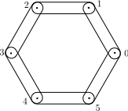
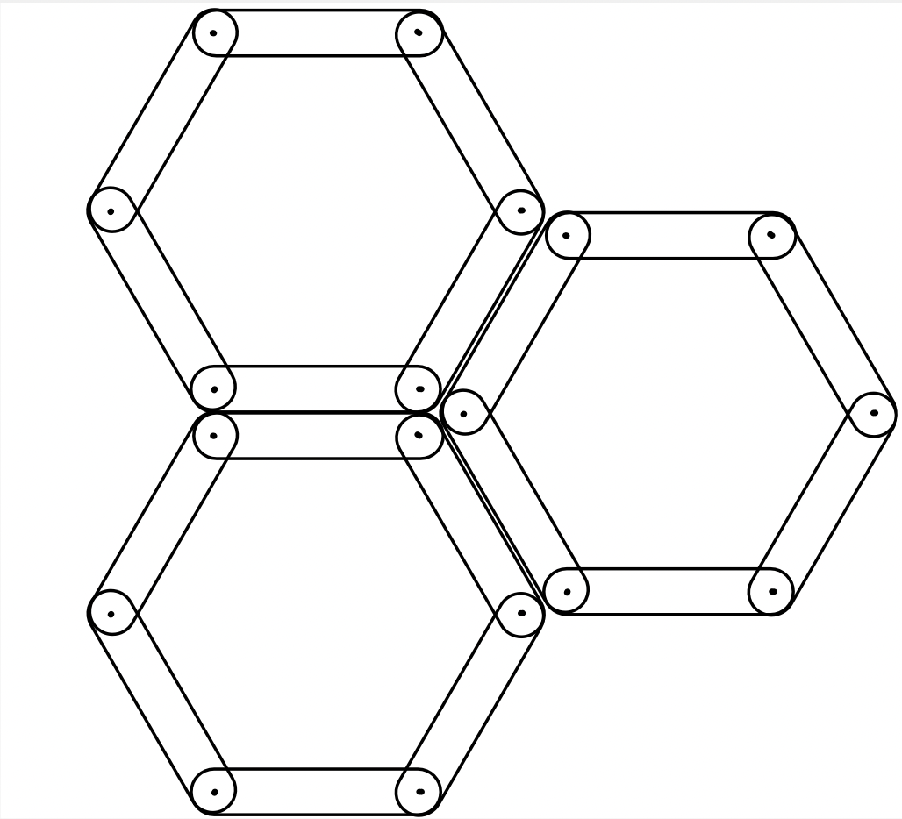

Model
=====

Generalities about DEM methods
------------------------------

The model we have built is substantially similar to a form of DEM. The basic concept is to model a material as a collection of rigid elements that interact. The materials we are particularly interested in are cells of the plant tissue. So we agreed to create polygons to best represent our cells (:numref:`Cells`). The nodes/summits of the polygons would be our discrete elements and we connect them by bars. When the bars close the polygon, we call it a cell (:numref:`Cells`). 

.. _Cells:

   Representation of a cell. Each node is numbered from 0 to 5 in this case.
   
   
Let :math:`m` be the mass of the nodes, :math:`I` the inertia along the normal axis, :math:`\vec{\overset{\cdot \cdot}{x}}_i` the acceleration of the node, :math:`\vec{\overset{\cdot \cdot}{\theta}}_i` the angular acceleration, :math:`\vec{f^{j \rightarrow i}}` the force due to the action of the particle :math:`j` on the particle :math:`i`, :math:`\vec{b}` the lever-branch vector from particle center to the contact point and :math:`\vec{g}` the volume acceleration (like gravity in most cases). We then have :

.. math::
   \begin{split}
   m \vec{\overset{\cdot \cdot}{x}}_i &= \underset{j \neq i}{\sum} \vec{f^{j \rightarrow i}} + m \vec{g}\\
   I \vec{\overset{\cdot \cdot}{\theta}}_i &= \underset{j \neq i}{\sum} ||\vec{b} \times \vec{f^{j \rightarrow i}}|| +
   \underset{j \neq i}{\sum} C^{j \rightarrow i}
   \end{split}

The DEM method essentially consists in integrating its equations to find a weak solution. The quadrature we use is the velocity-Verlet scheme: 

.. math::
   \begin{split}
    \vec{x}^{(t+\delta t)}_i &= \vec{x}^{(t)}_i + \delta t \vec{\overset{\cdot}{x}}^{(t)}_i + \frac{\delta t}{2} \vec{\overset{\cdot \cdot}{x}}^{(t)}_i\\
    \vec{\overset{\cdot}{x}}^{(t+\delta t)}_i &= \vec{\overset{\cdot}{x}}^{(t)}_i + \delta t \frac{\vec{\overset{\cdot \cdot}{x}}^{(t)}_i + \vec{\overset{\cdot \cdot}{x}}^{(t+ \delta t)}_i}{2} 
   \end{split}
   
   
   

Details of the model for our case
---------------------------------

We wish to study the rupture of a very heterogeneous structure such as that of a plant (:numref:`PlantStruc`). Naturally, the geometry of the object we wish to fragment allows us not to take into account its depth and thus to propose a 2D model. Indeed, a stem is essentially a tube whose section has a complex structure but a tube all the same. 

.. _PlantStruc:

  
   Micrograph of a plant structure. Some plant tissues like this one can be very regular with cells close to what a Voronoi-Laguerre diagram would give us. We can observe (despite a great regularity), that some cells are broken or rather crushed, giving them a more complex geometry

Plant tissue can be seen as an aggregation of cells. A cell consists of an outer membrane that is more difficult to break. This observation leads us to construct cells from bars and nodes that are connected to create cells (:numref:`WhatACell`). The space between the cells is designated as the fragile zone. The bars that are parts of the membranes will be designated as the fragile areas of the model. We apply a glue bond. The rupture will therefore be created when the force that pulls two cells apart reaches a certain threshold.

.. _WhatACell:

   
   Example of aggregation of identical, convex and regular cells. The cells must be joined by a glue relationship

This model gives us a clear advantage over a classic DEM because it allows us to work on materials not only rigid.

Details of Forces used in the Model
-----------------------------------

Our model is close to a material point model for the nodes. The description of a node is reduced to the position of its center of gravity, its mass and its link (like the angle with the next bar) (:numref:`NodesBarsOr`) with the second elements of our model: the bars (Fig . The bars work like springs which have a plasticity, a stiffness and a length. 

.. _NodesBarsOr:

  
   Set of characteristics of the bar class taken into account by node

In an implementation way, we do a test to know if there is contact or not (:numref:`NodesBarsCon`). Our bars have a kind of contactbox that we use to determine if we should distribute a possible interaction to the nodes. The forces (interactions) linked to the bars are transferred to the concerned nodes 

.. _NodesBarsCon:

   Nodes and Bars interacting as contact. In this case, it is a node that "sees" a bar. :math:`\vec{f}` is the contact force and we decompose it into :math:`\vec{n}` and :math:`\vec{t}` the normal and the tangential component.

In order to determine the forces and moments required for computing the accelerations, we need local computations able to calculate the forces or moments as a function of local parameters. 

Interactions Forces
-------------------

These forces are those that are exerted between several physical objects defined in our model. The first to describe is : The elastic repulsion (normal force) between object :math:`i` and :math:`j`, :math:`f^{e, i \rightarrow j}_n` is calculated when the contactbox/control is activated. :math:`f^{e, i \rightarrow j}_n` is defined by : 

.. math::
    f^{e, i \rightarrow j} = \mathcal{E}(v_i,v_j)

where :math:`\mathcal{E}` is a function depending of the velocity and position of the objects :math:`i` and :math:`j`. :math:`v_i` and :math:`v_j` are respectively the velocity of object :math:`i` and :math:`j`.

In this model we also have a glue force between the cells (like in :numref:`WhatACell`). Keeping the same notations, we will describe the glue force as :math:`f^{g, i \rightarrow j}` :

.. math::
    f^{g, i \rightarrow j} = \mathcal{G}(v_i,v_j,k_n,k_t)

where :math:`\mathcal{G}` is a function depending of the velocity and position of the objects :math:`i` and :math:`j` and two coefficient of cohesion :math:`k_n` and :math:`k_t`. :math:`v_i` and :math:`v_j` are respectively the velocity of object :math:`i` and :math:`j`.

Node Force and Moment
---------------------

These are the forces that are exerted on the nodes directly without the need for redistribution to the nodes to obtain the accelerations. 

We use a global viscosity to dissipate energy physically. Let :math:`N` be a node, the viscosity on the node :math:`N` is described by :math:`f^{v}_N` :

.. math::
    f^{v}_N = -\nu \times Vel(N)     

where :math:`Vel` is the application that gives us the speed of a node. :math:`\nu` is a dissipation parameter that we fix at the beginning of the simulation.

The last step is to simulate the plasticity of the bars we transmit. The moments are directly managed in the Node class as shown in the :numref:`NodesBarsOr`. Let :math:`\Theta` be a function depending of the velocity of the node :math:`N` :

.. math::
    Mom_{t+1}(N) = Mom_t(N) -k_r \times \Theta(Vel(N))

where :math:`Mom_t(N)` is the function that determine the moment at the node :math:`N` by the incremental way. And for the plasticity, we apply a threshold like on :numref:`Plasticity` : 

.. _Plasticity:

   Threshold function for plasticity
	

It is possible to impose a speed or a force on each node independently or by cell directly. 

.. _UML:

   UML Diagram of the algorithm. The physical objects (nodes, bars, cells) are data boxes that evolve over time. The heart of L-hyphen lies in the sample and especially in the methods contactNodeForces and contactInteractionForces
	

More Details of the model
-------------------------

This section is dedicated to the slight description of the methods present in the sample (:numref:`UML`): computeInteractionForces() and computeNodeForces().

So let's explain how we compute the contact :

We set :math:`u` et :math:`b` comme suit : 

.. math::
	\begin{split}
    	u &= N^j_{k+1} - N^j_{k}\\
    	b &= N^i_{l} - N^j_{k}
		\end{split}

Soient :math:`f^t_n` le coefficient de la force normale de contact au temps :math:`t`, :math:`k_n` .
On calcule la vitesse relative du noeud par rapport à barre en négligeant l'épaisseur des barres.
S'il y a contact alors : 

.. math::
	\begin{split}
    	f^t_n &= -k_n \times |b \times urot| - (R^i + R^j)\\
    	V_{relative} &= Vel(N^i_i) - ((1 - (b \frac{u}{||u||})) \times Vel(N^j_j) + (b \frac{u}{||u||}) \times Vel(N^j_{j+1}))
		\end{split}

Soit T une valeur seuil.

.. math::
	\begin{split}
    	T &= \mu f^t_n\\
    	f_t &= sgn(f_t) T \mathbb{1}_{|f_t| > T}
		\end{split}

In the case when :math:`\vec{n}` is est orienté vers le noeud, :math:`f_n` est positive donc correspond à une force de la barre qui pousse le noeud. Il s'agit donc de transférer les forces vers les noeuds concernés.

.. math::
	\begin{split}
    	f^{t+dt}_n &= f^{t}_n - f_{adherence}\\
    	For(N^i_l,t+dt) &= For(N^i_l,t) + f^{t+dt}_n \vec{n} + f_t \times dt\\
    	For(N^j_k,t+dt) &= For(N^j_k,t) - ((1 - (b \frac{u}{||u||}) \times For(N^i_l,t) \\ &+ f^{t+dt}_n \vec{n} + f_t \times dt)\\
    	For(N^j_{k+1},t+dt) &= For(N^j_{k+1},t) - (b \frac{u}{||u||} \times For(N^i_l,t) \\ &+ f^{t+dt}_n \vec{n} + f_t \times dt)
		\end{split}

We also present some explaination on the computation of the contact when we have glue between cells. 

Let :math:`C_i` be the cell :math:`i`, :math:`J` the set of cells neighboring :math:`C_i`. We will call :math:`N^i` the set of nodes of cell :math:`i`. :math:`N^i_k` the node :math:`k` of cell :math:`i`. For all :math:`C_j \in J` :  

Let Finally :math:`k \in \{1,...,Card(N^j)\}` and :math:`l \in \{1,...,Card(N^i)\}`
If :

.. math::
	(||\vec{N^j_k} - \vec{N^i_l}|| - (R^i + R^j + \epsilon_{\text{glue}} )^2 < 0)

where :math:`R^i` and :math:`R^j` are respectively the radii of cells :math:`C_i` and :math:`C_j` and :math:`\epsilon_{\text{glue}}` the gluing distance. Let :math:`k_{n_{cohesive}}` be the normal coefficient of the contact due to the glue. Then we apply (using :math:`Vel` the function which gives the velocity of a node).

.. math::
	\begin{split}
    	u &= N^j_{k+1} - N^j_{k}\\
    	b &= N^i_{l} - N^j_{k}\\
    	V_{relative} &= Vel(N^i_i) - ((1 - (b \frac{u}{||u||})) \times Vel(N^j_j) \\ &+ (b \frac{u}{||u||}) \times Vel(N^j_{j+1}))\\
    	f_{n_{cohesive}}^{t+1} &= f_{n_{cohesive}}^{t} - k_{n_{cohesive}} \times V_{relative} \times \vec{n} \times dt\\
    	\mathcal{F}_{glue} &= f_{n_{cohesive}}^{t+1} \times \vec{n}\\
		\end{split}

where :math:`\mathcal{F}_{glue}` is the normal force due to the glue and :math:`f_{n_{cohesive}}^{t}` is the computational value of the force at time :math:`t`
