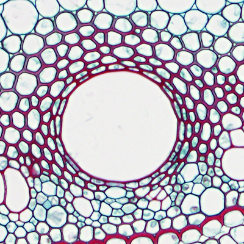

Pre-processing
==============

Transform a picture into a pgm format
-------------------------------------

This can be done using ``convert`` from imageMagick.

.. code-block:: sh

   convert <inputImage> -compress none pgm:- | tr -s '\012\015' ' '  > <output>.pgm

   This is the caption of the figure (a simple paragraph).

 
The application ``cellPropro``
------------------------------

expliquer ce que font les commandes, et la methode utilisée