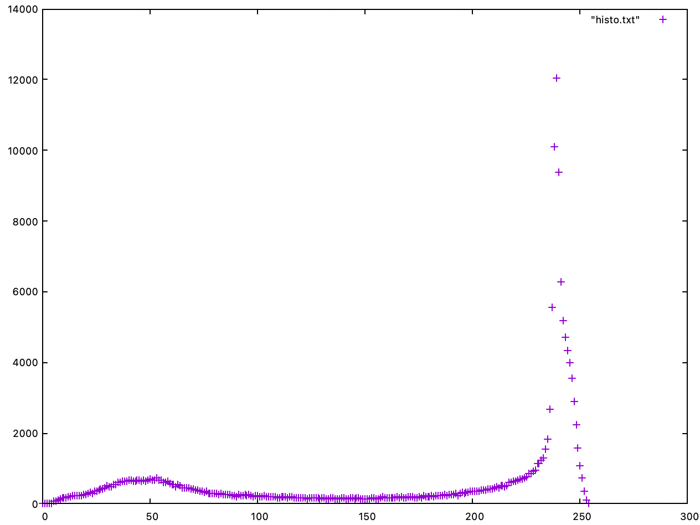
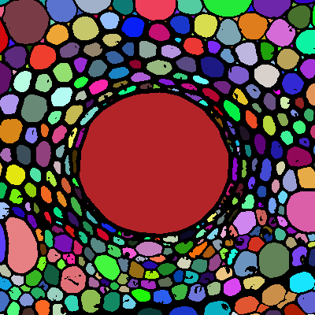
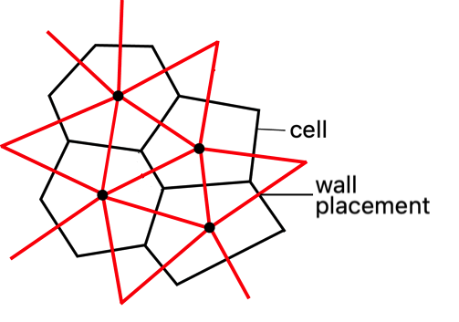
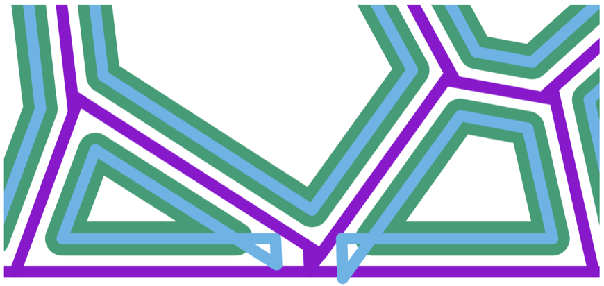

Pre-processing
==============

Transform a picture into a pgm format
-------------------------------------

This can be done using ``convert`` from imageMagick.

.. code-block:: sh

   convert <inputImage> -compress none pgm:- | tr -s '\012\015' ' '  > <output>.pgm

.. figure:: images/Corn.jpg
   :width: 400

   Example of image that can be preprocess for the usage of l-hyphen.

 
The application ``cellPropro``
------------------------------

read_pgm <nom_de_l’image>.pgm : A partir de <nom_de_l’image>, on crée une matrice greymap :math:`G \in \mathcal{M}_{lx,ly}` avec :math:`lx` et :math:`ly` le nombre de pixel de l’image respectivement dans la direction horizontale et verticale de l’image telle que :math:`G_{x,y} = greyLevel(pixel= \{x,y\})`

make_histo : Crée un histogramme des valeurs de :math:`G_{x,y}`. Le format de sortie est (dans « histo.txt ») : ":math:`greyLevel`  :math:`\# \{ \{x,y\} | G_{x,y} = greyLevel \}` "

.. _histo:

   histogram associated to :math:`G`

segmentation <valeur_de_seuil> : On applique la règle suivante : 
Si :math:`greyLevel` <   <valeur_de_seuil>   alors :math:`G_{x,y} = 0`
Sinon :math:`G_{x,y} = -1`

fill_cells : Applique un algorithme de floodfill sur l’ensemble des pixels de l’image qui ont :math:`G_{x,y} = -1` en associant une couleur à chaque cellule :math:`couleurCell`.

.. _floodfill:

   Floodfilled cells

write_pgm <Nom_Image_Colorisee>.pgm : Rend l’image après segmentation et colorisation des cellules au format pgm P3.

add_centers_image <Taille_du_centre> : Permet de créer une image où l'on a ajouté à l'image avec les cellules colorisées, des carrées blanc de côté <Taille_du_centre> sur la position du barycentre de chaque cellule.

create_cell_dataset : On crée :math:`C \in \mathcal{T}_{lx,ly,col}` où :math:`\mathcal{T}` est l’espace des tenseurs de dimension 3 et :math:`col` est la dimension qui recevra le numero de cellule telle que : si :math:`G_{x,y} = -1` on ait :math:`C_{x,y} = couleurCell`

clean_cell_data <minPixNumber> : Fonction qui permet de retirer de l'ensemble des cellules récupérées par la fonction create_cell_dataset, les cellules ayant un nombre de pixels inférieur à <minPixNumber>

save_cell_dataset <filename>.txt : Crée un fichier <filename>.txt qui contiendra un numéro de cellule, les coordonnées du barycentre et le nombre de pixel de la cellule associée : 

.. code-block:: text
   :caption: save_cell_data.txt
   
   #id x y nbPixels
   0 2.97101 8.65217 138
   1 19.5588 57.1452 1777
   2 12.5524 119.501 925
   3 4.40079 176.44 252
   4 20.5551 223.911 1742
   5 36.2095 8.93296 716
   6 38.6984 171.722 1280
   7 51.6002 130.259 1018
   8 56.7127 91.3937 978
   9 77.9512 211.594 1823
   10 73.8247 51.2803 1409
   11 81.5923 10.3728 802
   12 94.6366 155.133 1629
   13 105.438 102.343 1500
   14 123.424 36.2523 1815
   15 117.192 222.434 537
   16 125.639 178.583 302
   17 162.889 237.411 1106
   18 144.147 117.743 599
   19 149.256 75.6544 816
   20 171.595 199.114 1564
   21 174.04 153.349 1764
   22 165.212 28.9345 656
   23 190.737 96.3358 1766
   24 215.32 42.0961 2893
   25 220.891 227.82 1081
   26 221.343 135.753 728
   27 226.106 163.7 160
   28 237.718 187.66 688
   29 237.142 98.9573 445
   30 246.9 135.343 251
	
max_wall_width <valeur_taille_paroi> : 

neighbor_strategy <disks ou delaunay> : Fonction qui permet de créer une trouver l'ensemble des voisins d'une cellule pour ensuite constituer une tesselation fidèle. La méthode employée peut-être la triangulation de delaunay (pour l'utiliser, écrire : neighbor_strategy delaunay), 
ou une tesselation qui fonctionne comme suit : 

Soit :math:`dist_{i,j}` la distance entre le centre de la cellule :math:`i` et le centre de la cellule :math:`j`. Si :math:`dist_{i,j} \leq` <valeur_taille_paroi>, la cellule :math:`j \in` l'ensemble des voisins de la cellule :math:`i` et la cellule :math:`i \in` l'ensemble des voisins de la cellule :math:`j`.

build_cells : La procédure va créer des cellules que pourra utiliser l-hyphen

.. code-block:: c++
   :caption: build_cells function

   if (neighbor_strategy == "delaunay") {
      find_neighbors_delaunay();
    } else if (neighbor_strategy == "disks") {
      find_neighbors_disks();
    }

    for (size_t i = 0; i < cells.size(); i++) {
      std::vector<vec2r> tmp;
      tmp.push_back(vec2r(0.0, 0.0));
      tmp.push_back(vec2r(lx, 0.0));
      tmp.push_back(vec2r(lx, ly));
      tmp.push_back(vec2r(0.0, ly));
      cells[i].convex_hull = convexHull(tmp);
    }

    for (size_t i = 0; i < cells.size(); i++) {
      for (size_t k = 0; k < cells[i].neighbors.size(); k++) {
        size_t j = cells[i].neighbors[k];

        vec2r pos_plan = find_wall_pos(i, j);

        vec2r normal(cells[i].x - cells[j].x, cells[i].y - cells[j].y);

        normal.normalize();
        cut_polyg_with_plan(cells[i].convex_hull, pos_plan, normal);
      }
    }

.. _tesselation:

   Tesselation 

repair_cell <0 ou 1> : Parfois dans la construction des cellules, nous avons un chevauchement des barres

.. _tesselation:

   Tesselation et création des cellules. repair_cell = 0 en bleu, repair_cell = 1 en vert. 

On voit clairement que les noeuds proviennent de l'intersection des parois de la tesselation que nous avons shifted parallèlement. Malheureusement, parfois, certaines cellules trop petites ou allongées donc les barres se coupent. La stratégie de reconstruction revient à prendre l'intersection de ces barres à la place comme noeuds et enlever les deux qui posaient problème

create_lhyphen_input 1.0 2.0 : 

